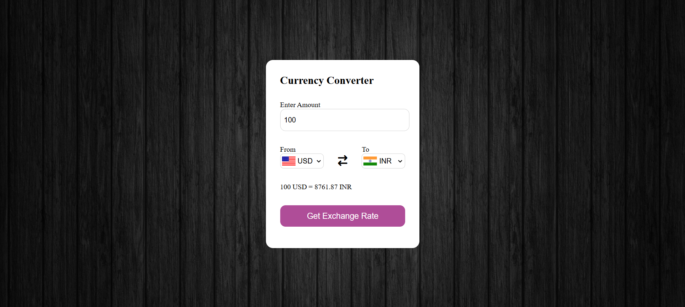

# Currency Converter

A simple web-based currency converter that allows users to convert between different currencies using real-time exchange rates. Built with HTML, CSS, and JavaScript.

## Features

- Convert between multiple currencies
- Real-time exchange rates via [@fawazahmed0/currency-api](https://github.com/fawazahmed0/currency-api)
- Country flag display for selected currencies
- Responsive and clean UI

## Demo

 <!-- Add a screenshot of your app here if available -->

## Getting Started

### Prerequisites

- A modern web browser (Chrome, Firefox, Edge, etc.)

### Installation

1. **Clone the repository:**
   ```powershell
   git clone https://github.com/Rupendra0/Currency-Converter.git
   ```
2. **Navigate to the project directory:**
   ```powershell
   cd Currency-Converter
   ```
3. **(Optional) Add your own background image:**
   - Place your image (e.g., `wood-1759566.jpg`) in the project folder or use your own image path in `style.css`.

### Usage

1. Open `index.html` in your web browser.
2. Enter the amount you want to convert.
3. Select the source and target currencies.
4. Click "Get Exchange Rate" to see the converted amount.

### File Structure

- `index.html` - Main HTML file
- `style.css` - Styles for the app
- `script.js` - Main JavaScript logic
- `country.js` - Country code and currency mapping

## License

This project is licensed under the MIT License.

```
MIT License

Copyright (c) 2025 Rupendra0

Permission is hereby granted, free of charge, to any person obtaining a copy
of this software and associated documentation files (the "Software"), to deal
in the Software without restriction, including without limitation the rights
to use, copy, modify, merge, publish, distribute, sublicense, and/or sell
copies of the Software, and to permit persons to whom the Software is
furnished to do so, subject to the following conditions:

The above copyright notice and this permission notice shall be included in all
copies or substantial portions of the Software.

THE SOFTWARE IS PROVIDED "AS IS", WITHOUT WARRANTY OF ANY KIND, EXPRESS OR
IMPLIED, INCLUDING BUT NOT LIMITED TO THE WARRANTIES OF MERCHANTABILITY,
FITNESS FOR A PARTICULAR PURPOSE AND NONINFRINGEMENT. IN NO EVENT SHALL THE
AUTHORS OR COPYRIGHT HOLDERS BE LIABLE FOR ANY CLAIM, DAMAGES OR OTHER
LIABILITY, WHETHER IN AN ACTION OF CONTRACT, TORT OR OTHERWISE, ARISING FROM,
OUT OF OR IN CONNECTION WITH THE SOFTWARE OR THE USE OR OTHER DEALINGS IN THE
SOFTWARE.
```

---
**How to use:**  
- Download or clone the repository.
- Open `index.html` in your browser.
- Follow the on-screen instructions to convert currencies.

---
```# Currency Converter

A simple web-based currency converter that allows users to convert between different currencies using real-time exchange rates. Built with HTML, CSS, and JavaScript.

## Features

- Convert between multiple currencies
- Real-time exchange rates via [@fawazahmed0/currency-api](https://github.com/fawazahmed0/currency-api)
- Country flag display for selected currencies
- Responsive and clean UI

## Demo

 <!-- Add a screenshot of your app here if available -->

## Getting Started

### Prerequisites

- A modern web browser (Chrome, Firefox, Edge, etc.)

### Installation

1. **Clone the repository:**
   ```powershell
   git clone https://github.com/Rupendra0/Currency-Converter.git
   ```
2. **Navigate to the project directory:**
   ```powershell
   cd Currency-Converter
   ```
3. **(Optional) Add your own background image:**
   - Place your image (e.g., `wood-1759566.jpg`) in the project folder or use your own image path in `style.css`.

### Usage

1. Open `index.html` in your web browser.
2. Enter the amount you want to convert.
3. Select the source and target currencies.
4. Click "Get Exchange Rate" to see the converted amount.

### File Structure

- `index.html` - Main HTML file
- `style.css` - Styles for the app
- `script.js` - Main JavaScript logic
- `country.js` - Country code and currency mapping

## License

This project is licensed under the MIT License.

```
MIT License

Copyright (c) 2025 Rupendra0

Permission is hereby granted, free of charge, to any person obtaining a copy
of this software and associated documentation files (the "Software"), to deal
in the Software without restriction, including without limitation the rights
to use, copy, modify, merge, publish, distribute, sublicense, and/or sell
copies of the Software, and to permit persons to whom the Software is
furnished to do so, subject to the following conditions:

The above copyright notice and this permission notice shall be included in all
copies or substantial portions of the Software.

THE SOFTWARE IS PROVIDED "AS IS", WITHOUT WARRANTY OF ANY KIND, EXPRESS OR
IMPLIED, INCLUDING BUT NOT LIMITED TO THE WARRANTIES OF MERCHANTABILITY,
FITNESS FOR A PARTICULAR PURPOSE AND NONINFRINGEMENT. IN NO EVENT SHALL THE
AUTHORS OR COPYRIGHT HOLDERS BE LIABLE FOR ANY CLAIM, DAMAGES OR OTHER
LIABILITY, WHETHER IN AN ACTION OF CONTRACT, TORT OR OTHERWISE, ARISING FROM,
OUT OF OR IN CONNECTION WITH THE SOFTWARE OR THE USE OR OTHER DEALINGS IN THE
SOFTWARE.
```

---
**How to use:**  
- Download or clone the repository.
- Open `index.html` in your browser.
- Follow the on-
